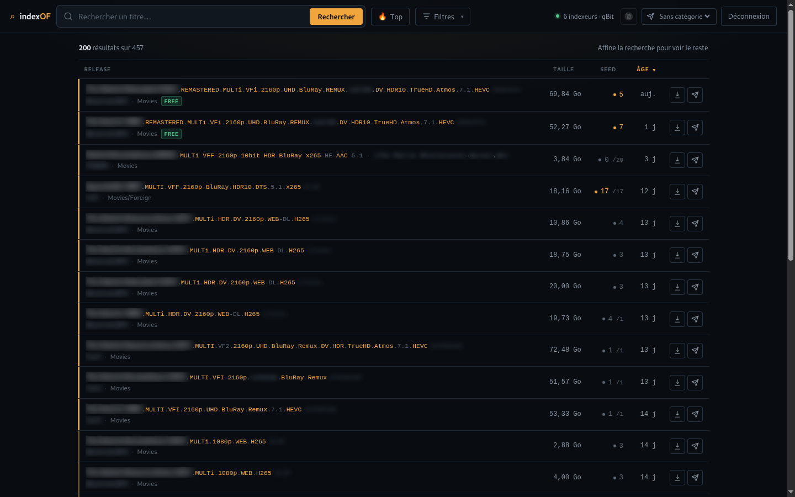

<h1 align="center">indexOF</h1>

<p align="center">
  Recherche unifiée sur vos indexeurs <a href="https://prowlarr.com/">Prowlarr</a> :
  une requête, tous les trackers, et le torrent part vers qBittorrent en un clic.
</p>

<p align="center">
  <a href="https://github.com/micferna/indexOF_Prowlarr/actions/workflows/ci.yml"></a>
  <a href="https://discord.gg/4P5teKzGUE"> Rejoignez le Discord</a>
</p>

<p align="center">
  
  <br>
  <sub>Noms de release et d'indexeurs floutés pour la capture.</sub>
</p>

---

## Démarrage rapide (Docker)

```bash
cp exemple.env .env
# Générez un secret applicatif :
sed -i "s/^APP_SECRET=.*/APP_SECRET=$(openssl rand -hex 32)/" .env

docker compose up -d --build
```

- Application : <http://localhost:8080>
- Prowlarr : <http://localhost:9696>
- qBittorrent : <http://localhost:8081>

> Les trois services n'écoutent que sur la loopback : exposez-les via un reverse-proxy TLS, pas directement.

### Configurer Prowlarr

1. Ouvrez Prowlarr (<http://localhost:9696>), créez le compte admin.
2. Récupérez la clé API dans **Settings → General → Security → API Key**.
3. Reportez-la dans `.env` (`PROWLARR_API_KEY=...`), puis ajoutez des indexeurs.
4. Redémarrez l'app : `docker compose up -d`.

> `PROWLARR_BASE_URL` vaut `http://prowlarr:9696` : les services communiquent par leur nom sur le réseau Docker.

## L'interface

Un nom de release, c'est `The.Matrix.1999.REMASTERED.MULTi.2160p.BluRay.REMUX.DV.HDR-REBiRTH`.
C'est ce que vous venez lire, donc c'est ce que l'interface met en avant : la partie
lisible passe en clair, les tokens techniques sont mis en valeur là où ils sont déjà
écrits, le groupe de release s'efface. Pas de pastilles recopiées sous chaque ligne.

- **Recherche dynamique** sans rechargement, état partageable par URL (`?q=…&days=…&trackers=…`).
- **Top** : les derniers uploads de tous vos trackers, sans taper de requête.
- **Liseré de qualité** à gauche de chaque ligne : la résolution d'une liste se lit verticalement.
- **Filtres** réunis dans un seul panneau — période, catégories, indexeurs, puis affinage
  (seeders minimum, freeleech, qualité) sur les résultats affichés. Ce qui est actif
  remonte en jetons retirables au-dessus de la liste.
- **Contenu du `.torrent`** avant de le prendre : un fichier ou un pack de quarante
  épisodes ? La liste se déplie sous la ligne, sans rien télécharger dans qBittorrent.
- **Santé des indexeurs** : cliquez sur l'indicateur d'état pour voir la latence, le
  volume et les échecs de chacun. C'est ce qui explique une recherche qui traîne.
- **Filtre par taille** (tranches cliquables) et **exclusion de mots** dans la
  requête : `matrix -animated`.
- **Doublons regroupés** : la même release publiée sur plusieurs trackers tient
  sur une ligne, menée par la source la mieux seedée. Les autres sont repliées
  derrière un « +N » et restent téléchargeables individuellement.
- **Défilement infini** : la suite se charge en descendant.
- **Raccourcis clavier** : `/` recherche, `j`/`k` navigation, `Entrée` ouvrir,
  `d` télécharger, `e` envoyer, `c` copier le magnet, `?` l'aide complète.
- **Tri** par titre, taille, seeders ou âge, mémorisé, accessible au clavier.
- **Actions** : télécharger le `.torrent` (proxy chiffré), ouvrir ou copier le magnet,
  envoyer à qBittorrent avec choix de la catégorie, ou pousser la release vers
  Sonarr / Radarr / Lidarr / Readarr.
- **Recherches enregistrées** : mettez de côté une requête et ses filtres, rejouez-la
  d'un clic depuis le panneau Filtres — et **abonnez qBittorrent à son flux RSS**
  pour qu'il récupère les nouveautés sans que vous ouvriez l'application.
- **« Déjà pris »** : les releases que vous avez déjà envoyées sont marquées dans les
  résultats, avec la date et la destination. Le rapprochement se fait sur le titre
  enregistré au moment de l'envoi, pas sur le nom que le client a pu réécrire.
- **Historique des envois**, consultable et purgeable depuis la vue Transferts : il
  garde la trace même après suppression du torrent.
- **Transferts** : ce que qBittorrent télécharge ou partage, sans quitter l'app —
  progression, ratio, vitesses, état. Arrêt, relance et suppression (avec ou sans
  les fichiers, en deux temps, sans boîte de dialogue). Filtres d'état et actions
  groupées pour quand la liste s'allonge. Rafraîchi toutes les 3 s, uniquement
  quand la vue est ouverte.
- **Masquage des noms d'indexeurs** en un bouton, persisté localement ; le survol révèle.
- **Filtre -18** appliqué côté serveur, indicateur des indexeurs en erreur, historique local.

## Configuration (`.env`)

| Variable | Description | Défaut |
|----------|-------------|--------|
| `PROWLARR_API_KEY` | Clé API Prowlarr | — (obligatoire) |
| `PROWLARR_BASE_URL` | URL de Prowlarr, sans slash final | — (obligatoire) |
| `APP_SECRET` | Secret de scellement des liens (≥ 16 car., `openssl rand -hex 32`) | — (obligatoire) |
| `APP_PASSWORD` | Mot de passe d'accès. Vide = démarrage refusé, sauf `AUTH_DISABLED=1` | — (obligatoire) |
| `AUTH_DISABLED` | `1` pour assumer une app sans authentification | `0` |
| `RESULT_LIMIT` | Nombre max de résultats par recherche | `200` |
| `QBITTORRENT_URL` | URL Web UI qBittorrent. Vide = envoi désactivé | _(vide)_ |
| `QBITTORRENT_USER` / `QBITTORRENT_PASS` | Identifiants de la Web UI qBittorrent | `admin` / _(vide)_ |
| `PROWLARR_TIMEOUT` | Délai d'une recherche (s). Les trackers sont interrogés en direct | `45` |
| `QBITTORRENT_TIMEOUT` | Délai des appels qBittorrent (s) | `15` |
| `SONARR_URL` / `SONARR_API_KEY` | Sonarr. Vide = bouton absent | _(vide)_ |
| `RADARR_URL` / `RADARR_API_KEY` | Radarr | _(vide)_ |
| `LIDARR_URL` / `LIDARR_API_KEY` | Lidarr | _(vide)_ |
| `READARR_URL` / `READARR_API_KEY` | Readarr | _(vide)_ |
| `TRUST_PROXY` | `1` seulement derrière un reverse-proxy qui pose `X-Forwarded-For` | `0` |
| `DATA_DIR` | Répertoire de la base SQLite (historique, recherches enregistrées) | `/var/lib/indexof` |
| `CACHE_TTL` | Durée du cache recherches/indexeurs (s) | `120` |
| `CACHE_DIR` | Répertoire de cache | `/tmp/indexof_cache` |

## Envoi vers qBittorrent

Renseignez `QBITTORRENT_URL` (ex. `http://qbittorrent:8081`) pour faire apparaître le bouton d'envoi, ainsi que `QBITTORRENT_USER` / `QBITTORRENT_PASS`.

N'utilisez **pas** le contournement d'authentification par sous-réseau (*Options → Web UI → Bypass authentication for clients in whitelisted IP subnets*) : il ouvre la Web UI — donc le contrôle total du client BitTorrent, y compris l'exécution d'un programme externe — à tout ce qui atteint le réseau Docker. La Web UI doit exiger un mot de passe, avec *CSRF protection* et *Host header validation* actives.

> Le port publié doit être identique au port interne (`WEBUI_PORT`) : qBittorrent valide le port de l'en-tête `Host` et rejette tout le reste.

## Flux RSS

Chaque recherche enregistrée expose un flux. Le bouton **RSS** du panneau Filtres
copie son adresse ; collez-la dans qBittorrent (*Vue RSS → Nouvel abonnement*), et
il ira chercher les nouveautés tout seul.

Un lecteur RSS ne peut pas ouvrir de session : l'accès repose sur le jeton secret
présent dans l'URL, propre à chaque recherche. Supprimer la recherche révoque le
flux. Le flux ne contient jamais l'URL Prowlarr réelle : les pièces jointes
pointent vers le proxy de téléchargement, avec un lien scellé.

> **Adresse à utiliser depuis un conteneur.** Le bouton copie l'adresse telle que
> vous voyez l'application (`http://localhost:8080/rss.php?t=…`). Un qBittorrent
> qui tourne dans le même Docker Compose ne joint pas `localhost` : remplacez
> l'hôte par le nom du service, soit `http://web/rss.php?t=…`.

## Sonarr, Radarr et consorts

L'application ne remplace pas les *arr : elle leur passe le relais. Un bouton par
application apparaît sur chaque résultat dès que son URL et sa clé API sont
renseignées. La release est poussée via `release/push` ; l'application la parse,
la rapproche de ce qu'elle suit, applique ses profils de qualité et la confie à
son propre client de téléchargement.

Le retour est affiché tel quel : « acceptée et mise en téléchargement », ou le
motif du refus (« Unknown Series », qualité déjà présente…). Pas de faux succès.

Sonarr et Radarr sont fournis dans le `docker-compose.yml`, derrière un profil —
rien ne démarre sans le demander :

```bash
docker compose --profile arr up -d
```

- Sonarr : <http://localhost:8989> · Radarr : <http://localhost:7878>
- Récupérez la clé API de chacun (*Settings → General*) et reportez-la dans `.env`.
- Dans Prowlarr, ajoutez-les en **Apps** : il y synchronisera vos indexeurs.
- Les trois services partagent `./data/downloads` : c'est ce qui permet aux *arr
  de retrouver les fichiers que qBittorrent a terminés.

## Sécurité

- **Authentification obligatoire** : `APP_PASSWORD` (session + CSRF). Sans lui, l'app refuse de démarrer, à moins de poser explicitement `AUTH_DISABLED=1`.
- **Liens de téléchargement scellés** : les URLs Prowlarr (qui contiennent la clé API) ne sont jamais envoyées au navigateur. Le client reçoit un jeton chiffré (AES-256-GCM) à durée de vie limitée, que seul le serveur peut ouvrir.
- **Proxy `.torrent` anti-SSRF** : schémas `http(s)` uniquement, rejet des IP privées/réservées, épinglage de l'IP validée (anti-DNS-rebinding), re-validation à chaque redirection, plafond de taille et timeouts.
- **Anti-brute-force** : `limit_req` nginx sur les POST de login + verrouillage applicatif (10 échecs / 15 min par IP).
- **En-têtes** : CSP stricte (pas d'inline, pas de CDN), `nosniff`, `no-referrer`, `frame-ancestors 'none'`.
- **Conteneurs durcis** : non-root, `cap_drop: ALL`, `no-new-privileges`, système de fichiers en lecture seule, ports liés à la loopback.
- **Dégradation propre** : si la base n'est pas accessible en écriture, les recherches enregistrées et l'historique disparaissent de l'interface — la recherche, elle, continue de fonctionner.

En production : terminez le TLS sur un reverse-proxy, décommentez `Strict-Transport-Security` dans `docker/nginx.conf`, et si le proxy pose `X-Forwarded-For`, mettez `TRUST_PROXY=1` **et** configurez le module `realip` de nginx (sinon le rate-limit voit l'IP du proxy et un seul attaquant verrouille tout le monde).

## Structure

```
public/                 # Racine web exposée (seul ce dossier est servi)
  index.php             # Coquille HTML (aucune donnée sensible)
  login.php / logout.php# Authentification (si APP_PASSWORD défini)
  api.php               # API JSON : status + indexeurs + recherche (jetons scellés)
  send.php              # Envoi d'un torrent vers qBittorrent (auth + CSRF + jeton)
  download_torrent.php  # Proxy .torrent sécurisé (jeton chiffré + anti-SSRF)
  assets/               # CSS et JS, servis sans dépendance externe
src/                    # Hors racine web
  config.php            # Chargement de la configuration (env > .env)
  auth.php              # Session, mot de passe, jeton CSRF
  ProwlarrClient.php    # Client API Prowlarr (cURL, X-Api-Key, cache, timeouts)
  QbittorrentClient.php # Client Web API qBittorrent (ajout par URL/magnet)
  functions.php         # Échappement, URL, jetons scellés, XML, formatage
  Search.php            # Recherche partagée par l'API et les flux RSS
  TorrentFetcher.php    # Récupération .torrent anti-SSRF (proxy + aperçu)
  Bencode.php           # Lecture du contenu d'un .torrent
  ArrClient.php         # Client Sonarr/Radarr/Lidarr/Readarr (release/push)
  Store.php             # Base SQLite : envois mémorisés, recherches enregistrées
tests/                  # Tests PHPUnit (fonctions critiques)
docker/nginx.conf       # Vhost nginx (reverse-proxy FastCGI vers php-fpm)
Dockerfile              # Multi-stage : php-fpm (app) + nginx (web), base Alpine
docker-compose.yml      # web (nginx) + php (php-fpm) + prowlarr + qbittorrent
.github/workflows/ci.yml# Intégration continue
.github/dependabot.yml  # Mises à jour composer, images Docker et actions
```

## Développement

```bash
composer install
composer test    # PHPUnit
composer stan    # PHPStan (niveau 7, analysé sur la plage PHP 8.1 → 8.5)
```

À chaque push, sur une pull request et une fois par semaine, la CI enchaîne :
lint PHP et JS, `composer audit` (CVE des dépendances), PHPStan et PHPUnit sur
PHP 8.3 **et** 8.5, construction des images, scan Trivy (CVE des images, secrets
commités, mauvaises configurations) et analyse CodeQL. Le rapport complet
remonte dans l'onglet *Security*.

L'exécution hebdomadaire n'est pas décorative : une CVE publiée après le merge
n'apparaît dans aucun scan déclenché par un commit.

## Sans Docker

Nécessite PHP 8.1+ avec les extensions cURL, JSON et OpenSSL. Définissez les variables d'environnement (ou créez `.env`), puis servez le dossier `public/` :

```bash
php -S 0.0.0.0:8080 -t public
```

## Contribuer

Les contributions sont bienvenues — lisez [CONTRIBUTING.md](CONTRIBUTING.md)
avant d'ouvrir une pull request, et [CODE_OF_CONDUCT.md](CODE_OF_CONDUCT.md)
pour le ton des échanges.

Une faille de sécurité ne se signale pas dans une issue publique :
[SECURITY.md](SECURITY.md) explique la marche à suivre.

## Licence

[MIT](LICENSE).
